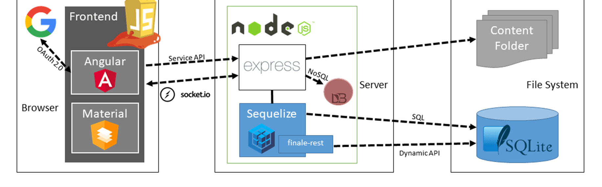

# Exercise #2 - Threat Model

- A threat model is basically a risk analysis that describes possible threats of the solution 

- The model could be a drawing based on a high-level architecture drawing where you add possible risks like:

  - APIs, any kind of connectivity you cannot control
  - Third party software you don’t own
  - Infrastructure you can’t control

- Also document the risks in detail, including an executive summary

  

* The model should include 
  * Detaillerd documentation of the risks
  * Documentation that all stakeholder accept possible risks, if so
* The model should include the classification of the data and the customer
  * This classification defines the security level you develop against
* The discussion about the threat model should include all stakeholders even the customer who should know all the risks.

### Exercise:

🕒 30 Minutes

🛒Create a threat model of the Juice Shop 

📃Document decisions

🖥️Present the threat model to the stakeholders 

